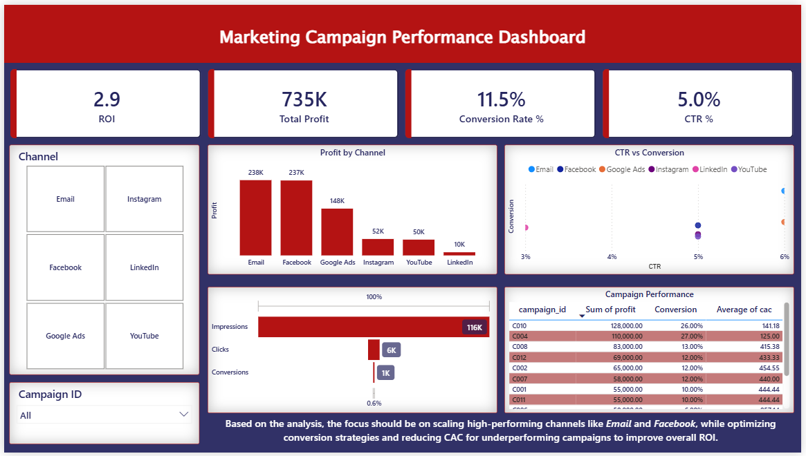

# 📊 Marketing Campaign Performance Analysis

## 📌 Project Overview
This project presents an end-to-end analysis of marketing campaign performance using **Python, SQL, and Power BI**.

The objective is to evaluate campaign effectiveness, identify inefficiencies, and generate actionable insights to improve overall marketing ROI.

---

## 🎯 Objectives
- Analyze campaign performance (profit, CTR, conversion rate, CAC)
- Identify high-performing and underperforming campaigns
- Perform funnel analysis (Impressions → Clicks → Conversions)
- Compare performance across marketing channels
- Provide data-driven business recommendations

---

## 🛠 Tech Stack
- **Python (Pandas)** – Data cleaning & preprocessing  
- **SQL** – Data analysis & querying  
- **Power BI** – Dashboard & visualization  

---

## 🧹 Data Cleaning (Python)
- Handled missing values  
- Standardized column names (lowercase, underscores)  
- Removed duplicates  
- Created derived features  
- Ensured data consistency  

---

## 📈 Data Analysis (SQL)
- Campaign performance analysis (profit, conversion rate, CAC)  
- Channel-level insights (profit, CTR, conversion trends)  
- ROI calculation and cost efficiency  
- Funnel drop-off analysis  
- Identified high CTR but low conversion campaigns  
- Business decision queries for optimization  

---

## 📊 Dashboard

---

## 🔍 Key Insights
- Email and Facebook are the top-performing channels in terms of profit  
- Some campaigns show high CTR but low conversion, indicating optimization opportunities  
- Significant drop observed from impressions to clicks in the funnel  
- High-performing campaigns contribute disproportionately to overall profit  
- Certain campaigns have high CAC, reducing cost efficiency  

---

## 🚀 Business Recommendations
- Scale high-performing channels (Email, Facebook)  
- Optimize campaigns with high CTR but low conversion  
- Improve landing page experience and targeting  
- Reduce CAC for underperforming campaigns  
- Reallocate budget based on ROI and performance  

---

## 🚀 Outcome
This project demonstrates:
- End-to-end data analysis workflow  
- Strong SQL querying skills  
- Data cleaning using Python  
- Dashboard development  
- Business insight generation  

---

## 📬 Contact
- LinkedIn: https://www.linkedin.com/in/anvitha-hg/  
- GitHub: https://github.com/anvithabhat  
